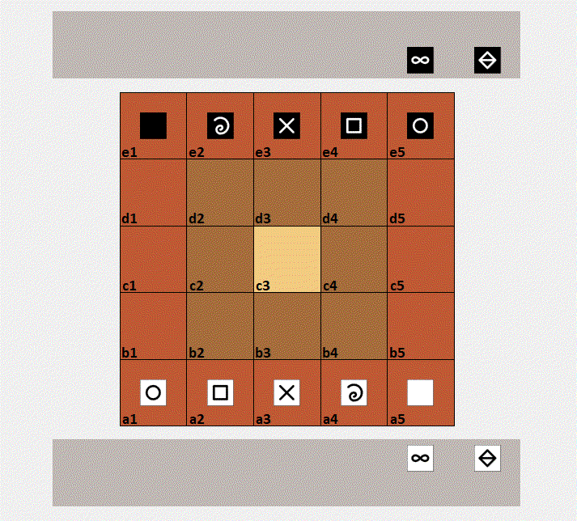

# Mikjersi

Mikjersi describes the rules of a micro-variant of the board game [*jersi*](https://github.com/LucasBorboleta/jersi), which aims to be more incisive and sharply than its ancestor. Mikjersi also serves as an introduction to Jersi.

Pronounce /`mik-jer-ssi`/ in [lojban](https://www.lojban.org/) : `mik` = micro and `jersi` = chase/persue.

The rules of Mikjersi are those of Jersi, but with the following major changes:

- **Board** -- The board is made of 5x5 squared cells.
- **Moves** -- The moves are only vertically and horizontally, but not along diagonal.
- **Cubes** -- Each player owns 7 cubes:  rock, paper, scissors, fool, king, mountain and wise.
- **Exchange of prisoners** -- For 2 turns during a game, when a player captures cubes whose sorts exist as prisoners by his opponent, then those prisoners are immediately exchanged and moved into their respective reserves.

The complete rules of Mikjersi can be found in the booklet either in [English](./Mikjersi-the-rules.pdf) or in [French](./Mikjersi-les-regles.pdf).

Above an animated game play from two AI agents of the sister project [*mikjersi-certu*]( https://github.com/LucasBorboleta/mikjersi-certu). 

If you intent to derive or to sell either a text, a product or a software from this work, then read the [**LICENSE**](./docs/LICENSE.md) document. 
