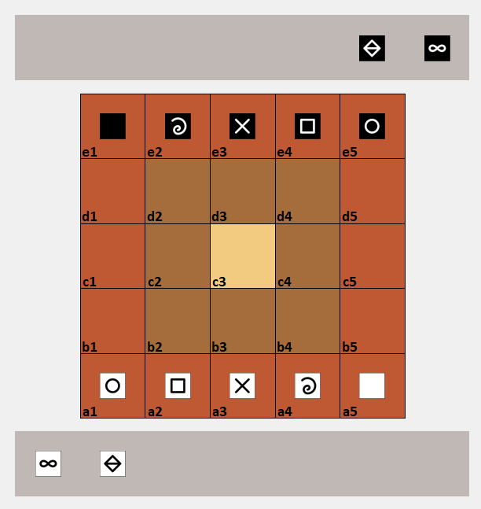

# Mikjersi

Mikjersi describes the rules of a micro-variant of the Jersi board-game [*Jersi*](https://github.com/LucasBorboleta/jersi). 

The rules of Mikjersi are those of Jersi, but with the following changes:

- **Board** -- The board is made of 5x5 squared cells.
- **Moves** -- The moves are only vertically and horizontally, but not along diagonal.
- **Cubes** -- Each player owns 1 cube of each sort:
  - 1 mountain and 1 wise man that start in the reserve.
  - 1 rock, 1 paper, 1 scissors, 1 fool and 1 king that start on the first row of each side.
- **Setting phase** -- At the beginning, the board is empty. Starting with whites, and alternating turns, each player puts a cube on his first row. The mountain and wise man are kept in the reserve. After this phase, the play continues as in Jersi.
- **Exchange of prisoners** -- When a player captures a cube whose sort exist as prisoner by his opponent, then those prisoners are immediately exchanged and moved into the respective reserves.
- **Drop** -- Each piece of the reserve, including retrieved prisoners, can be dropped.

This is a work in progress. The rules have not yet been tested to ensure their interest and fun.

If you intent to derive or to sell either a text, a product or a software from this work, then read the [**LICENSE**](./docs/LICENSE.md) document. 

A possible symmetric starting setup:

An animated game play from two IA agents:

